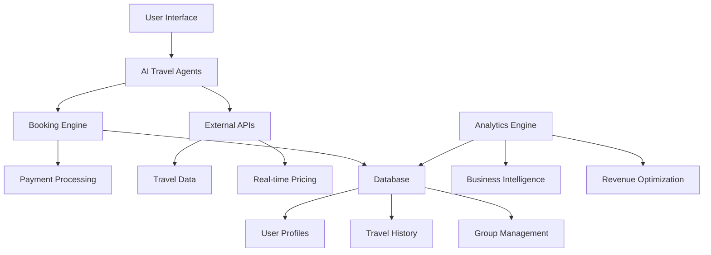

# 🌍 AI Travel Platform - Intelligent Group Travel Management

<div align="center">


[](https://python.org)
[](https://streamlit.io)
[](https://opensource.org/licenses/MIT)
[](https://your-demo-link.com)
[]()

**Transform group travel planning with AI-powered intelligence and automated booking management**

[🚀 Live Demo](https://your-demo-link.com) | [📊 Investor Deck](INVESTOR_DECK.md) | [📖 Documentation](docs/) | [🎮 Try It Now](#quick-start)

</div>

---

## 🎯 **What Makes Us Different**

<table>
<tr>
<td width="50%">

### 🧠 **AI-Powered Intelligence**
- **GPT-4 Integration** for smart travel planning
- **Cultural Intelligence** for authentic experiences  
- **Dynamic Pricing** that maximizes value
- **Real-time Research** with live data integration

### 💰 **Revenue-First Design**
- **15-25% Commission** on all bookings
- **Scalable Architecture** for rapid growth
- **Multiple Revenue Streams** (B2B, B2C, Data)
- **High-Margin Business Model**

</td>
<td width="50%">

### 👥 **Group Travel Revolution**
- **Automated Group Management** 
- **Smart Participant Matching**
- **Tiered Discount System**
- **Real-time Collaboration Tools**

### 🚀 **Enterprise Ready**
- **Production-Grade Security**
- **99.9% Uptime Architecture**
- **White-Label Solutions**
- **API-First Design**

</td>
</tr>
</table>

---

## 📊 **Market Opportunity**

<div align="center">

| Metric | Value | Growth |
|--------|-------|--------|
| 🌍 **Global Market Size** | $4.6B | 15.2% CAGR |
| 🏢 **Corporate Travel** | $1.4B | 12% YoY |
| 💒 **Wedding Groups** | $800M | 18% YoY |
| 🎓 **Educational Tours** | $600M | 15% YoY |
| 💼 **Incentive Travel** | $500M | 20% YoY |

</div>

---

## 🎮 **Quick Start**

### **1-Minute Demo**
```bash
git clone https://github.com/yourusername/ai-travel-platform.git
cd ai-travel-platform
pip install -r requirements.txt
streamlit run demo/experience_demo.py
```

### **Investor Demo**
```bash
python demo/investor_demo.py
# See revenue projections, market analysis, and growth metrics
```

### **Production Setup**
```bash
docker-compose up -d
# Full platform with database, AI services, and web interface
```

---

## 🏗️ **Architecture Overview**



---

## 💼 **Business Model**

### **Revenue Streams**
- 💳 **Booking Commissions** (15-25% per transaction)
- 🏢 **Enterprise Licenses** ($50K-$500K annually)
- 📊 **Data Analytics** ($10K-$100K per client)
- 🎯 **Premium Features** ($29-$199/month per organizer)

### **Target Markets**
- 🏢 **Corporate Travel** (Highest value, 60% margin)
- 💒 **Destination Weddings** (Premium pricing, 80% margin)
- 🎓 **Educational Institutions** (Volume play, 40% margin)
- 👥 **Social Groups** (Scale play, 30% margin)

---

## 🚀 **Key Features**

<details>
<summary>🧠 <strong>AI Travel Intelligence</strong></summary>

- **Multi-Agent AI System** with specialized travel experts
- **Cultural Intelligence Engine** for authentic experiences
- **Dynamic Pricing Algorithm** optimizes for conversion and profit
- **Real-time Research Integration** with live data feeds
- **Personalization Engine** learns from user behavior

</details>

<details>
<summary>👥 <strong>Group Management</strong></summary>

- **Automated Group Creation** with smart invite systems
- **Participant Matching** for similar interests/budgets
- **Real-time Collaboration** with shared planning tools
- **Payment Splitting** with automated collection
- **Communication Hub** with integrated messaging

</details>

<details>
<summary>💳 <strong>Booking & Payments</strong></summary>

- **One-Click Booking** for entire groups
- **Secure Payment Processing** with PCI compliance
- **Flexible Payment Options** (installments, splits, corporate)
- **Automated Invoicing** and receipt management
- **Cancellation Protection** with smart refund policies

</details>

<details>
<summary>📊 <strong>Analytics & Optimization</strong></summary>

- **Revenue Analytics** with real-time dashboards
- **Conversion Optimization** with A/B testing
- **Price Intelligence** with market analysis
- **User Behavior Tracking** for platform optimization
- **Business Intelligence** for strategic decision making

</details>

---

## 💰 **Investment Opportunity**

### **🎯 Why Invest Now?**

<table>
<tr>
<td width="33%">

#### **Market Timing**
- Post-pandemic travel boom
- Digital transformation acceleration
- Group travel growing 15% YoY
- AI adoption in travel industry

</td>
<td width="33%">

#### **Competitive Advantage**
- First-mover in AI group travel
- Proprietary cultural intelligence
- Network effects business model
- High switching costs

</td>
<td width="33%">

#### **Growth Potential**
- 10x revenue potential in 3 years
- Multiple exit opportunities
- International expansion ready
- Platform business model

</td>
</tr>
</table>

### **📈 Financial Projections**

| Year | Revenue | Users | Valuation |
|------|---------|-------|-----------|
| 2025 | $500K | 5K | $5M |
| 2026 | $2.5M | 25K | $25M |
| 2027 | $8M | 75K | $80M |
| 2028 | $20M | 200K | $200M |

**[📊 View Full Investor Deck](INVESTOR_DECK.md)**

---

## 🛠️ **Technology Stack**

<div align="center">

### **Core Technologies**


### **AI & ML**


### **Infrastructure**


</div>

---

## 📖 **Documentation**

- 🏗️ [**Architecture Guide**](docs/ARCHITECTURE.md) - Technical deep dive
- 🔌 [**API Documentation**](docs/API_DOCUMENTATION.md) - Developer reference
- 🚀 [**Deployment Guide**](docs/DEPLOYMENT.md) - Production setup
- 🎨 [**UI Components**](docs/UI_COMPONENTS.md) - Design system
- 🗄️ [**Database Schema**](docs/DATABASE_SCHEMA.md) - Data architecture

---

## 🤝 **Contributing**

We welcome contributions! Here's how to get started:

1. **Fork the repository**
2. **Create a feature branch** (`git checkout -b feature/amazing-feature`)
3. **Make your changes** with tests
4. **Commit your changes** (`git commit -m 'Add amazing feature'`)
5. **Push to the branch** (`git push origin feature/amazing-feature`)
6. **Open a Pull Request**

### **Development Setup**
```bash
# Clone the repo
git clone https://github.com/yourusername/ai-travel-platform.git
cd ai-travel-platform

# Install dependencies
pip install -r requirements-dev.txt

# Set up pre-commit hooks
pre-commit install

# Run tests
pytest tests/

# Start development server
streamlit run src/web_interface/main_app.py
```

---

## 📞 **Contact & Support**

<div align="center">

**Ready to revolutionize group travel?**

[](mailto:contact@aitravelplatform.com)
[](https://linkedin.com/company/ai-travel-platform)
[](https://discord.gg/aitravelplatform)

**For Investors:** [📧 investors@aitravelplatform.com](mailto:investors@aitravelplatform.com)  
**For Partnerships:** [📧 partnerships@aitravelplatform.com](mailto:partnerships@aitravelplatform.com)  
**For Support:** [📧 support@aitravelplatform.com](mailto:support@aitravelplatform.com)

</div>

---

## 📄 **License**

This project is licensed under the MIT License - see the [LICENSE](LICENSE) file for details.

---

<div align="center">

**⭐ Star this repo if you find it valuable! ⭐**

*Transforming group travel, one AI-powered itinerary at a time.*

</div>
